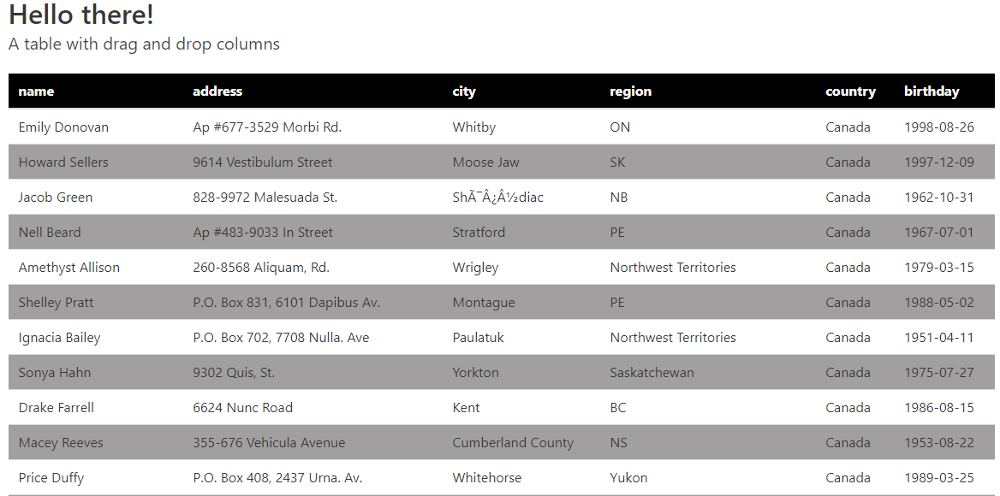

# The table

A table for people with design, additionally to the project it's possible to drag and drop columns on different places inside the table. The project is made with Bulma.io for simple design and made with react + redux, the project create a simple API rest to be used to call the data and work according to that. I hope you can see the effort on this little project.

## Trade-offs during the design

- I enjoyed doing the react - redux structure and use axios to use an API rest service with js, during all this week I've worked only with Ruby on Rails, so, it was good to remember this.
- This were the second project where I use bulma as a framework design. I like this framework, more than bootstrap but I consider materialize is good too for material design concept.
- I sttrugle a little bit to understand the concept `copy the first column, then add it to the second but don't forget to copy the info on second column too because you'll need it`. Thas was a little challenging to me.

## Something to improve?

- Something I didn't like it where the design when the mouse drag an element, the user are able to see the column name and how this "fly" on the screen to be inside another place, that's good, but would be excellent if the user could observe the "ghost" to the entire column being moved, and maybe the other columns moving to the sides to be according the new position (as trello, for example).
- Not all the variables on home component are props, this because some elements fails when the variable needs to carry a lot of information.
- Another thing I'd improve is the style, I understand is not part of the project but, I think is something to improve.

## How to use?

- You're able to scroll the page to see all the info in the page.
- To drag and drop use left click on a header column (wathever you want), then (holding down the click) drag the element to another header column position, then drop and you'll see how the column has been changed to the last one.

## Live demo

[Live demo here!](https://vichuge.github.io/react-eteam/)

## Data

[A basic api service to the project here!](https://vichuge.github.io/react-eteam/data.json)

## Built With

- JavaScript
- HTML5
- CSS3
- Ubuntu 20.04 (WSL)
- node 12.22.6
- npm 6.14.15
- React ^17.0.2
- Redux ^4.1.1
- Bulma

### Prerequisites

- Text Editor (VSCode is suggested.)

### Setup

- Open Terminal on desired folder to install
- Run `git clone https://vichuge.github.io/react-eteam/`
- cd react-eteam
- npm install or npm i
- npm start
- npm run test (if you would like to test the project)

## Author

👤 **Victor Pacheco**

- GitHub: [@vichuge](https://github.com/vichuge)
- LinkedIn: [LinkedIn](https://www.linkedin.com/in/victorpachecoflores/)
- Twitter: [@Pachecofloresv](https://twitter.com/Pachecofloresv)

## 🤝 Contributing

Contributions, issues and feature requests are welcome! 

## Show your support

Give a ⭐️ if you like this project!

## 📝 License

This project is [MIT](./LICENSE) licensed.